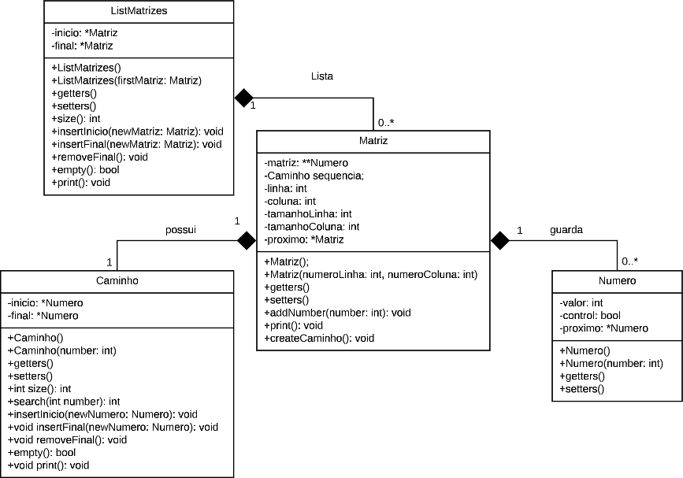
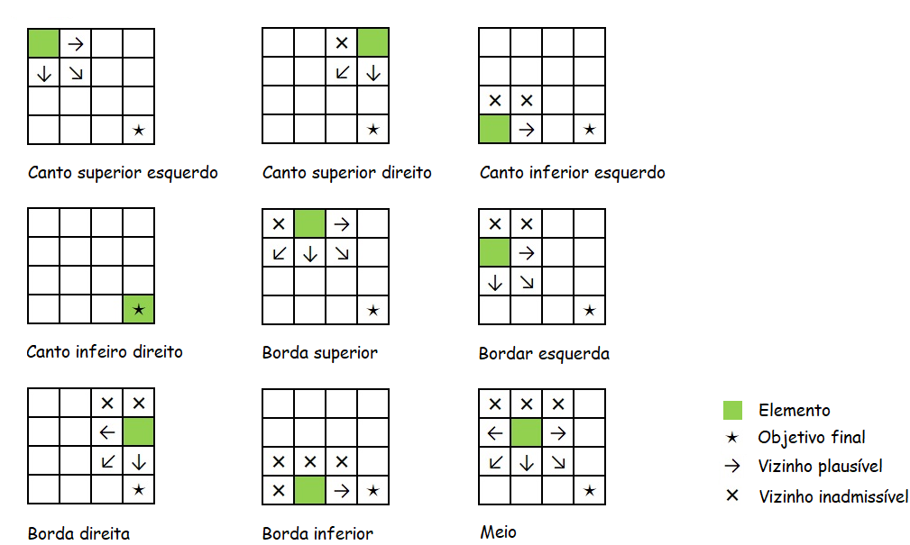

 <section>   
    <h1>📢 AEDS: Caminho Guloso</h1>   
    

        Criado em Março de 2023, o projeto <strong>Caminho Guloso</strong> foi desenvolvido em virtude de atender as demandas do curso de Algoritimo e Estrutura de Dados, ministrado pelo professor <a href="https://www.linkedin.com/in/michelpiressilva/?originalSubdomain=br" target="_blank">Michel Pires Da Silva</a> no Centro Federal de Educação Tecnológica de Minas Gerais (<a href="https://www.divinopolis.cefetmg.br/" target="_blank">CEFET-MG</a>).
    

</section>
<section>
    <h2>🛠 Problemática</h2>
    

        Atualmente, no universo da programação, saber trabalhar com o conceito de caminhamento em matrizes tem se tornado algo cada vez mais indispensável. Em função disso, este algoritimo apresenta um método para percorrer matrizes de forma gulosa, ou seja, optando por um dado caminho e não mais olhando para trás ou para decisões já tomadas. Assim sendo, o objetivo do algoritimo porposto neste projeto é caminhar por um conjunto de matrizes fornecidas como entrada e encontrar, para cada, o maior valor final do caminho seguido. Além disso, pretende-se com isso:
    

    <ul>
        <li>Revisar os conceitos de programação básica com matrizes;</li>
        <li>Começar um cenário de questionamentos para identificar se realmente a implementação realizada é a forma otimizada;</li>
        <li>Iniciar uma busca para uma boa estruturação de código.</li>
    </ul>
</section>
<section>
    <h2>🚧 Regras</h2>
    

        Ao se tratar das matrizes, o algoritimo deve enumerá-las, de forma a deixa-las organizadas para o processamento. Após isso, partindo da primeira matriz, o percurso do caminho guloso deve ser processado do primeiro elemento até que alcance o ultimo. Feito isso, o sistema tem que verificar se existem mais matrizes e caso haja realizar o mesmo processamento para todas.
    

    

        Ademais, no que se refere aos arquivos de entrada, deve-se seguir algumas regras preestabelecidas em ralação a como construir tais estruturas de dados. Nesse sentido, visando abranger o problema de forma mais generalizada, os arquivos de entrada suportam qualquer matriz de tamanho MxN, porém, tais dados devem ser organizados de formas bem específicas.
    

    

        <h3>🏃‍♂️💨 Caminhando nas matrizes</h3>
        

            O percurso realizado dentro das matrizes se basea nos conceitos do caminho guloso. Nesse sentido, para caminhar você deve sempre optar pelo valor da próxima casa, valor esse que deve ser o maior dentre eles. Caso haja empate entre casas, crie uma regra para adotar sempre uma mesma decisão de caminhamento. Dando continuidade, as regras para se considerar qual é a proxíma casa a ser seguida são:
        

        <ol type="a">
            <li>Avançar para a próxima coluna;</li>
            <li>Retroceder para coluna anterior;</li>
            <li>Saltar para a linha de baixo;</li>
            <li>Ir em diagonal para baixo.</li>
        </ol>
        

            Se a contagem chegar na ultima linha, independentemente em qual valor esteja a coluna, o algoritimo é obrigado a andar somente para a direita até que chegue ao fim. Além disso, é importante ressaltar que todas essas regras só se aplicam se a casa (posição i,j da matriz) ainda não tenha sido descoberta. Ou seja, o sistema tem que desconsiderar as posições já processada. Por fim, quando a contagem alcançar,  simultaneamente, a última linha e coluna da matriz o percurso é finalizado.
        

        

            Após o caminhamento guloso, apresente ao usuário qual foi o caminho adotado e qual a soma obtida do caminho realizado . Este processo deve ser feito para todas as matrizes existentes no arquivo de entrada. Além disto, mostre a soma total de todos os caminhos gulosos.
        

    

    

        <h3>📨 Arquivos de entrada</h3>
        

            Os arquivos utilizados para armazenar as matrizes devem ser do tipo <strong>Arquivo DATA</strong> (.data) ou <strong>Documento de texto</strong> (.txt). Estes, por sua vez, podem armazenar a quantidade de matrizes que o usuário desejar, desde que seus elementos sejam organizados de acordo com três possíveis modelos: I) Matrizes quadradas, II) Matrizes quadradas variadas e III) Matrizes dinâmicas.
        

        <ol type="i">
            <li>
                <h4><i>Matrizes quadradas: </i></h4>
                

                    Nesse padrão de entrada o sistema é capaz de incorporar apenas matrizes quadradas no tamanho NxN. Ou seja, todas as matrizes armazenadas nesse modelo devem possuir o mesmo numero de linhas e colunas.
                

                

                    Para representar as matrizes quadradas, é preciso declarar seus tamanhos fixos na primeira linha do arquivo de entrada. A seguir, na segunda linha de registro, é inserido os números da matriz, onde cada elemento deve ser separado por um espaço. Nesse sentido, a quantidade de números deve respeitar o tamanho (N N) informado na primeira linha do arquivo de entrada. Após isso, para armazenar outras matrizes basta separa-las por uma linha em branco.
                

                

                    Segue o exemplo de como criar um arquivo de entrada para matrizes quadradas de tamanho 7X7 no Arquivo DATA <a href="https://github.com/LuanLuL/AEDS---Caminho-Guloso/blob/developer/input.data">input.data</a>. 
                

            </li>
            <li>
                <h4><i>Matrizes quadradas variadas: </i></h4>
                

                    Esse modelo também sustenta a entrada matrizes quadradas no tamanho NxN, entretanto, diferente do primeiro padrão de entrada, neste cada matriz pode ter seu próprio tamanho. Ou seja, todas as matrizes armazenadas nesse modelo são quadradas, mas pode-se armazenar matrizes com dimensões distintas umas das outras.
                

                

                    Para inserir as matrizes quadradas variadas, é preciso declarar o número de seu tamanho na linha anterior à matriz. A seguir, na próxima linha de registro, é dado entrada aos números, onde cada elemento deve ser separado por um espaço. Nesse sentido, a quantidade de números deve respeitar o tamanho (N) informado para cada matriz. Após isso, para guardar mais matrizes basta repetir o esquema. Atenção, não pode haver nenhuma linha em branco nesse tipo de entrada. 
                

                

                    Segue o exemplo de como criar um arquivo de entrada para matrizes quadradas variadas no Arquivo DATA <a href="https://github.com/LuanLuL/AEDS---Caminho-Guloso/blob/developer/input_2.data">input_2.data</a>.
                

            </li>
            <li>
                <h4><i>Matrizes dinâmicas: </i></h4>
                

                    Sendo o modelo mais completo, o terceiro padrão de entrada consegue ler matrizes dinâmicas de tamanho MxN. Ou seja, cada matriz pode ter seu respectivo número de linhas e colunas. Dessa forma o arquivo de dados é capaz de armazenar qualquer matriz que o usuário deseje incorporar no sistema.
                

                

                    Para armazenar as matrizes dinâmicas, é preciso declarar, respectivamente, o número de linhas e colunas na linha anterior à matriz. Após isso, na próxima linha de registro, é colocado os números, onde cada elemento deve ser separado por um espaço. Lembre-se que a quantidade de números deve respeitar o tamanho (M N) informado para cada matriz. Caso seja necessário mais de uma matriz basta repetir o esquema. Atenção, esse tipo de entrada também não pode conter nenhuma linha em branca.                    
                

                

                    Segue o exemplo de como criar um arquivo de entrada para matrizes dinâmicas no Arquivo DATA <a href="https://github.com/LuanLuL/AEDS---Caminho-Guloso/blob/developer/input_3.data">input_3.data</a>.
                

            </li>
        </ol>
    

</section>
<section>
    <h2>✅ Solução proposta</h2>
    

        Depois de compreendido a problemática e suas respectivas regras, a estratégia de resolução apresentada se baseia em dividir o problema em partes. Primeiramente, é necessario criar uma forma organizada de armazenar as matrizes dentro do programa, na qual é empregado os conceitos da Orientação a Objetos. Em seguida é preciso estabelecer meios sucintos para efetivar a leitura dos arquivos de entrada; três métodos foram desenvolvidos para satisfazer essa demanda. Por último e mais importante, o caminho guloso de cada matriz deve ser mostrado juntamente com a soma final dos elementos percorridos. 
    

    

        <h3>💍 Engenharia do sistema</h3>
        

            A ferramenta utilizada para construção do sistema é  a linguagem de programação C++. Sendo orientada a objetos (POO), o C++ é usado tanto para comunicação em máquinas quanto para desenvolvimento de softwares acadêmicos e corporativos, jogos e entre outras coisas. Foi escolhida por ser considerada uma das linguagens de programação mais rapidas dos mundo e por possuir as funcionalidades de POO — <a href="https://cplusplus.com/doc/tutorial/" target="_blank">saiba mais</a>.
        

        

            Com o intuito de organizar os dados selecionados através dos arquivos de entrada, o sistema é composto por quatro classes: ListMatrizes, Matriz, Numero e Caminho. Observe mais na Figura 1.  
        

         
        

            
              <strong>Figura 1:</strong> Diagrama de classes do sistema
        

         
        

            Essencialmente, o software contém duas estruturas de listas encadeadas, as classes <i>ListMatrizes</i> (armazena todas as matrizes lidas na entrada) e <i>Caminho</i> (armazena o caminho guloso de cada matriz). Também existe a classe <i>Matriz</i>, a qual se faz jus o nome. No mais, resta apenas a classe <i>Numero</i>, cuja o objetivo é representar os elementos da matriz, informando se já foi ou não processado pelo sistema com o uso do atributo <i>control: bool</i>.
        

    

    

        <h3>📜 Selecionando os dados</h3>
        

            No que se refere aos arquivos, o usuário pode selecionar três padrões diferentes para dar entrada no sistema. Nessas circunstâncias, é evidente que também deve haver três métodos diferentes para realizar a leitura dos arquivos. Está seção visa discutir um pouco sobre as táticas utilizadas para realizar a identificação de cada um dos padrões.  
        

        

            É importante destacar a utlização da biblioteca <code>fstream</code>, a qual possui recursos essenciais para a manipulação de arquivos externos. A partir dela, conseguimos ler as linhas, palavras e letras dos inputs utilizados como entrada. Nesse sentido, a ideia geral é percorrer os documentos até o final pegando as linhas que indicam o tamanho das matrizes e as palavras que reperesentam os elementos das matrizes. Isso só é possível pois cada número está separado por espaços. 
        

        

            Assim sendo, segue abaixo o algoritimo que exemplifica as tomadas de decições gerais que ocorrerm nos padrões de entrada:
            <pre>
    1 - Abrir o arquivo externo de dados
    2 - Verificar o estado do arquivo de entrada
        2.1 - Se o documento for aberto com sucesso vá para o passo 3
        2.2 - Se houver algum erro na abertura mostre-o e finalize o programa
    3 - Percorrer o arquivo de entrada enquanto não chegar em seu final 
    4 - Transformar os textos analizados para números inteiros
    5 - Verificar o significado da informação lida
        5.1 - Se representar o tamanho das linhas e colunas vá para o passo 6
        5.2 - Caso represente o valor numérico de um elemento vá para o passo 7
    6 - Criar a matriz IxJ, onde I é o n° de linhas e J o n° de colunas
    7 - Armazenar número dentro da matriz
    8 - Verificar se a matriz está completa
        8.1 - Se a matriz estiver cheia vá para o passo 9
        8.2 - Caso contrário volte para o passo 5 
    9 - Armazenar a matriz na lista encadeada
    10 - Vericar se há outra matriz no arquivo de entrada
        10.1 - Se existe mais matrizes volte para o passo 5
        10.2 - Se não existir mais nenhuma matriz vá para o passo 11
    11 - Fechar o arquivo externo de dados
    12 - Retornar a lista de matrizes</pre>
        

        

            Observe de forma mais detalhada os métodos reponsáveis por interpretar os diferentes tipos de arquivos de entrada localizados no arquivo <code>main.cpp</code>:
        

        <a href="https://github.com/LuanLuL/AEDS---Caminho-Guloso/blob/developer/src/main.cpp">
            
<code>ListMatrizes lerMatrizesQuadradas(string txt){...}</code>

            
<code>ListMatrizes lerMatrizesQuadradasVariadas(string txt){...}</code>

            
<code>ListMatrizes lerMatrizesDinamicas(string txt){...}</code>

        </a>
        

            No decorrer da compilação, a principal dificuldade foi encontrar uma forma de diferenciar as linhas que repesentam os tamanho ixj das palavras que indicam os valores numéricos. Como o arquivo de entrada está organizado de maneira conhecida pelo programador, bastou criar variáveis auxiliares que controlam o momento exato ao qual se encontrava os tamanhos da linha (i) e coluna (j) da matriz.
        

        

            Outro problema encontrado sucede da alternancia de comandos. Ao longo do código, o objeto <code>fstream inFile</code> as vezes utiliza o <code>getline()</code> para selecionar toda a linha e outras o <code>inFile >> string</code> para pegar apenas as palavras. Nesse sentido, por algum motivo desconhecido, sempre ao alternar para o uso do <code>getline()</code> o programa selecionava uma linha em branco. Isso arruinava toda a lógica do sistema.
        

        
Todavia, essa adversidade foi facilmente resolvida. Em suma, foi necessário verificar se o <code>getline.size()</code>era menor do que o esperado. Caso for, o altogritmo salta para a proxima linha.

    

    

        <h3>👨‍💻 Configurações do caminho guloso</h3>
        

            Seguindo as regras preestabelcidas para a execução do caminho guloso, a solução apresentada se baseia na posição relativa do elemento em relação a matriz.
        

        

            A princípio, o processamento é iniciado no primeiro elemento da matriz. Fora esse, não há como saber a próxima posição a ser considerada. Sabe-se apenas que ela deve ter o maior valor dentre todos os vizinhos do elemento anterior. Nesse sentido, primeiro devemos encontrar a posição relativa do elemento para depois verificar os seus possíveis valores vizinhos. Isso é de extrema importância, pois assim evitamos que os números pertencentes a matriz sejam comparados com algum lixo de memória.
        

        

            As possíveis posições a serem ocupadas dentro da matriz e os vizninhos estão representados na Figura 2.
        

        

            
              <strong>Figura 2:</strong> Posições e vizinhos dentro da matriz
        

         
        

            Após descobrir qual é a posição do elemento em relação a matriz, automaticamente conhecemos também os vizinhos. Assim sendo, para encontrar o próximo elemento pertencente ao caminho guloso basta comparar os valores e o maior entre eles assim será. Além disso, é necessario verificar se a posição do próximo elemento já foi processada pelo sistema; caso já tenha sido esse vizinho se torna inadmissível e o sistema o desconsidera como uma possibilidade. Essa apuração é significativa, visto que sem ela o caminho guloso pode entrar em uma volta inacabável.
        

        

            Contudo, tem-se ainda a possibilidade de que os valores entre os possíveis vizinhos sejam iguais. Quando o sistema se deparar com uma situação dessas é implementado uma ordem de prioridade para o próximo elemento do caminho guloso: i) diagonal inferior direita, ii) baixo, iii) direita, iv) diagonal inferior esquerda e v) esquerda.
        

        

            Observe de forma mais detalhada o método reponsável por processar o caminho guloso das matrizes localizado no arquivo <code>matriz.cpp</code>:
        

        <a href="https://github.com/LuanLuL/AEDS---Caminho-Guloso/blob/developer/src/Matriz.cpp">
            
<code>void Matriz::createCaminho(){..}</code>

        </a>
    

</section>
<section>
    <h2>🎞 Processamento</h2>
    

        Durante o deselvovimento do algoritimo apresentado nesse repositório, foi-se utilizado de três principais tecnologias: Visual Studio Code e WSL:Ubunto.
    

    <ul>
        <li>    
            

                O Visual Studio Code é um editor de texto multiplataforma disponibilizado pela Microsoft para o desenvolvimento de aplicações, Conhecer essa ferramenta é importante para os desenvolvedores que pretendem trabalhar em ambientes multiplataforma, por exemplo,  podendo operar o desenvolvimento em ambiente Mac e Linux, ao mesmo tempo em que mantém o projeto compatível com Windows. Segue em anexo o link para o site da plataforma — <a href="https://code.visualstudio.com/" target="_blank">Visual Studio Code</a>.
            

        </li>
        <li>
            
O WSL é um método para se executar o Sistema Operaciona Linux dentro do Windows de forma muito facil. Essa platoforma se torna essencial para o desenvovimento em ambiente GNU Linux, evitando tarefas como a intalação de maquinas vituais, criação de dual booting no computador pessoal e entre outras coisas. Além disso, existem diversas vantagens como rodar programas em conjunto e compartihamento de localhost. Segue em anexo um  tutorial de download do WSL2 — <a href="https://youtu.be/hd6lxt5iVsg" target="_blank">Tutorial WSL2</a>.

        </li>
    </ul>
    

        Por fim, para que o processamento do algoritimo seja feito, é necessário o entendimento do menu de opções existente: 
        <pre>
    Aquivos disponíveis: 
        1 - input.data
        2 - input_2.data
        3 - input_3.data
        4 - Sair 
    Escolha o arquivo de entrada:
        </pre>
    

    

        O menu de opções é bem simples. Nele é possível realizar a leitura de três Arquivos DATA, cada arquivo está seguindo um dos diferentes padrões de entrada. Fique avontade para altera-los, mas lembre-se, é fundamental que os documentos sigam os padrões estabelecidos para não comprometer a leitura.
    

</section>
<section>
    <h2>🙌 Resultado Final</h2>
    

        Como resultado, assim que o usuário escolher a opção do arquivo de entrada, é impresso na tela a lista encadeada de matrizes, onde aparece juntamente a cada matriz o seu respectivo caminho guloso. Observe abaixo a impressão dos resultados atingidos no arquivo <code>input.data</code>:
        <pre>
    ************* INICIO ************* 
    Aquivos disponíveis: 
            1 - input.data
            2 - input_2.data
            3 - input_3.data
            4 - Sair 
    Escolha o arquivo de entrada: 1 
    478 664 153 268 500 997 991 
    903 762 253 590 868 842 682 
    707 409 87 351 565 496 251 
    485 564 114 584 413 863 22 
    388 307 545 585 972 417 572 
    192 415 565 814 178 537 405 
    765 380 806 193 509 893 263 
    Caminho Guloso: 478 903 762 707 564 545 814 806 193 509 893 263 = 7437 
    306 79 281 940 300 744 713 
    878 415 119 384 805 560 803 
    709 413 455 460 581 271 211 
    935 967 465 394 932 116 393 
    225 899 355 531 979 355 191 
    998 100 905 596 516 25 980 
    322 305 784 750 718 959 929  
    Caminho Guloso: 306 878 709 967 935 899 998 322 305 784 750 718 959 929 = 10459 
    A soma total dos caminhos gulosos é: 17896 
    ********************************* 
    Aquivos disponíveis: 
            1 - input.data
            2 - input_2.data
            3 - input_3.data
            4 - Sair 
    Escolha o arquivo de entrada: 4 
    Saindo... 
    ************* FIM *************
        </pre>
    

    

        Conclui-se então que a problemática do caminho guloso pode ser resolvida a partir de diversos pontos. A maneira  apresentada nesse repositório é so uma das diversas formas existentes para resolver esse problema. Porém, é assimilado que uma mesma matriz deve apresentar somente um único caminho guloso, desde que seja seguido as mesmas ordens de prioridade.
    

</section>
<section>
    

    

          

           Feito por <strong>Luan Gonçalves Santos</strong>     
         

         

          
        
        

    

</section>
